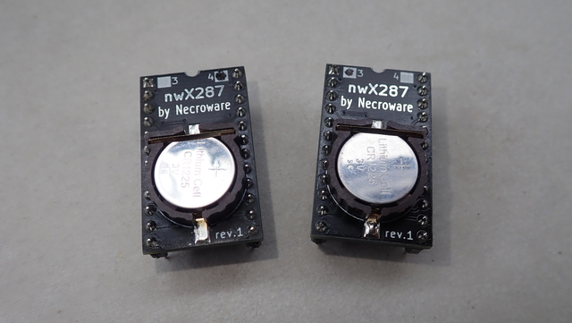

# Necroware's nwX287 RTC module

This is a version of Necroware's nwx287 but with an SMD crystal. This means you can solder the IC and crystal in one motion with a stencil.

## For sale on eBay and Tindie
https://www.ebay.com/itm/276981098778?mkcid=16&mkevt=1&mkrid=711-127632-2357-0&ssspo=An-bJCO5SaS&sssrc=2380676&ssuid=An-bJCO5SaS&widget_ver=artemis&media=COPY

## info from the original Repo

This part should be compatible with following RTC modules:

* Dallas DS1287 / DS12887 / DS12B887 (using BQ3285)
* Dallas DS1387 (using DS1385, untested so far)
* Dallas DS14287 (using BQ4285)
* Benchmarq BQ3287 (using BQ3285)
* Benchmarq BQ4287 (using BQ4285)
* ODIN OEC12C887 (using BQ3285)
* VIA VT82887 (using BQ3285)

Video: https://www.youtube.com/watch?v=svPNxILeQEw

### Force Motorola / Intel mode

The BQ3285 and most of the compatible chips can work in two modes Motorola and
Intel. The Motorola mode was usually used on home computers with Motorola CPU
and on x86 compatible PCs used the Intel mode. The BQ3285 and most compatible
chips have auto detection feature for the mode. If pin 1 is pulled high, then
the chip will work in Motorola mode and if it is set to low, then the Intel
mode is selected. Unfortunately very old systems used original RTC chips, where
the pin 1 was floating and the chips were hard wired internally to be always
either in Motorola or Intel mode. On this nwX287 replacement module pin 1 on
the PCB is connected to the pin 1 of the chip, so the mode selection should
work, however if accordant connection on the mainboard is floating, the chip
will go into the default mode, which is Intel. That will be a problem on older
systems, which expect the chip to be in Motorola mode. Therefore an optional
jumper was introduced on the module to force a particular mode if needed. If
the module is not workin in your system, try to put a solder blob as required.

### Bill of Materials

Part | # | Description
-----|---|-----------------------------------------
U1   | 1 | Real-Time Clock BQ3285S or BQ4285S SO-24
Y1   | 1 | Seiko SC32S-7PF20PPM SMD crystal 32.768kHz
BT1  | 1 | CR1220 / CR1225 SMD battery holder

